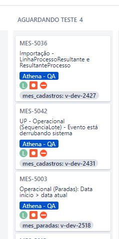

Para utilizar o script você vai precisar gerar um token no gitlab a partir do seu usuário, segue link ensinando a gerar o token:
https://docs.gitlab.com/ee/user/profile/personal_access_tokens.html#creating-a-personal-access-token
(Você vai precisar das permissões de acesso a API)

Para instalar o script você vai precisar da extensão tampermonkey no seu google chrome:
https://chrome.google.com/webstore/detail/tampermonkey/dhdgffkkebhmkfjojejmpbldmpobfkfo?hl=pt-BR

Depois e só clicar no link abaixo que a tela de instalação vai ser aberta, abrir qualquer board do jira e informar seu token no formulario que vai aparecer
https://raw.githubusercontent.com/jose-tissei/load-git-tags-to-jira-cards/master/load-git-tags-to-jira-cards.user.js
